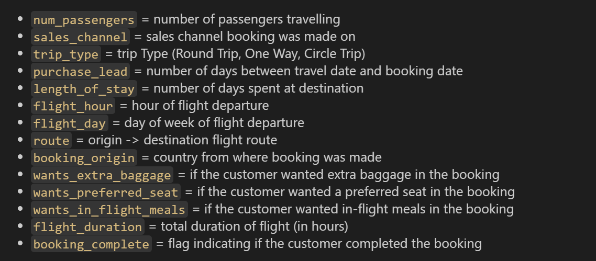
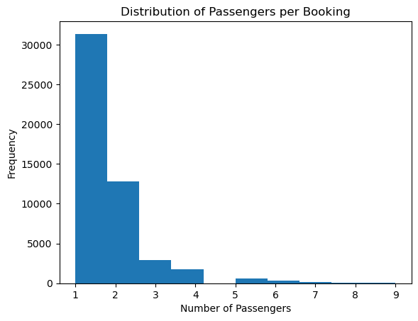
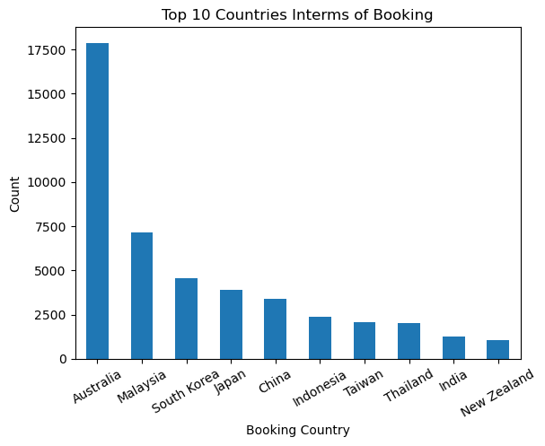
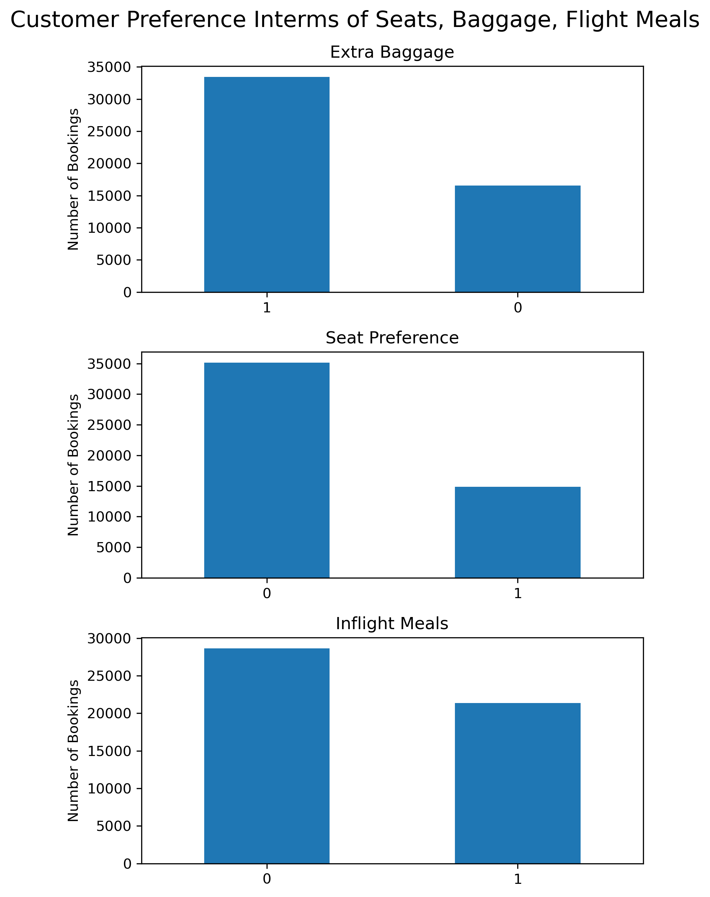
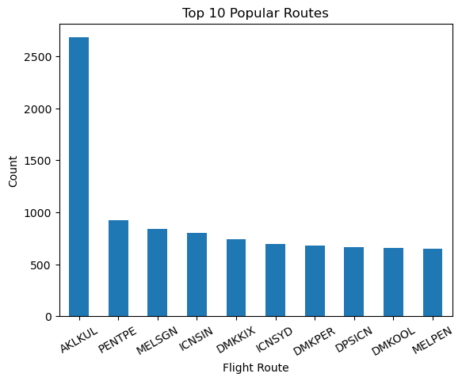
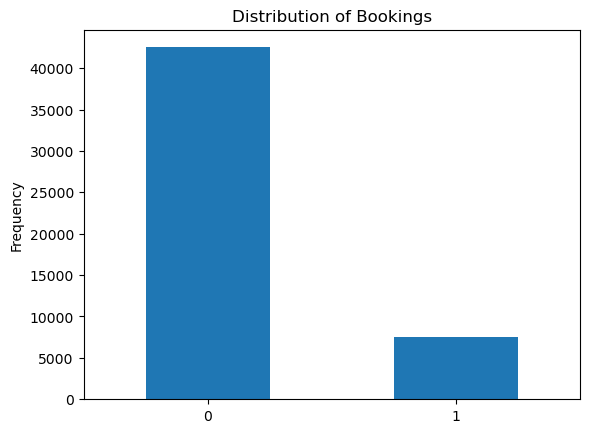
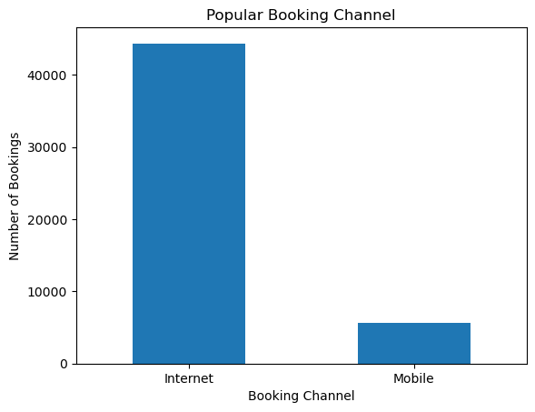
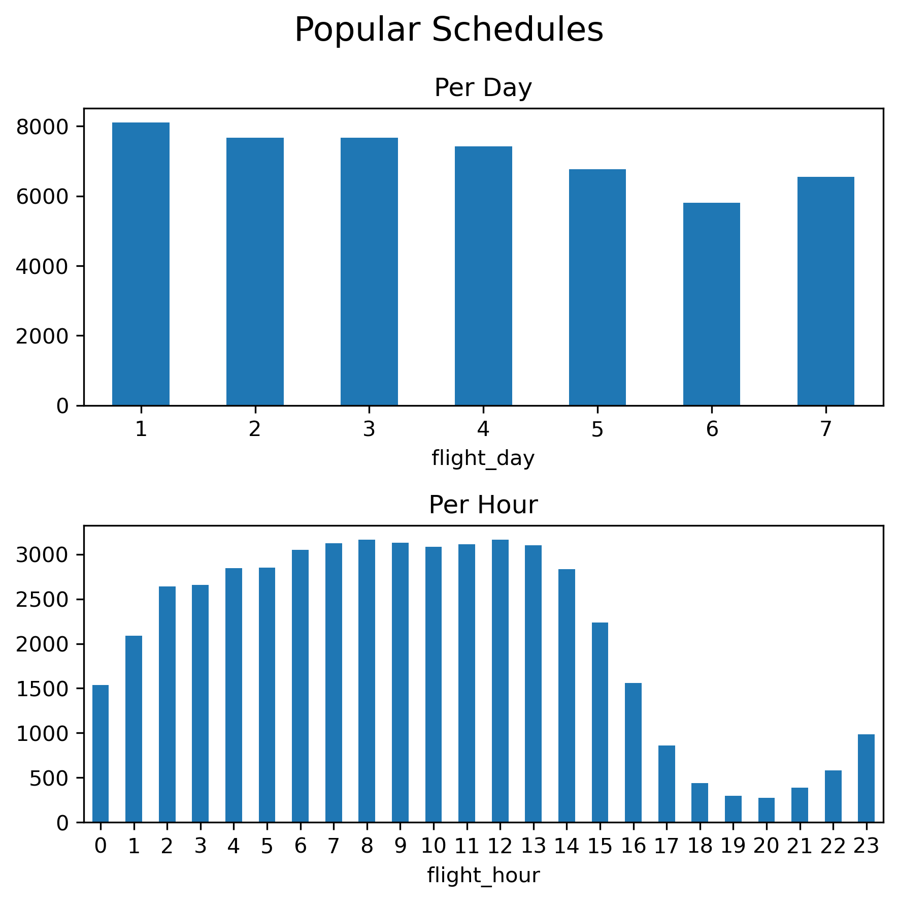
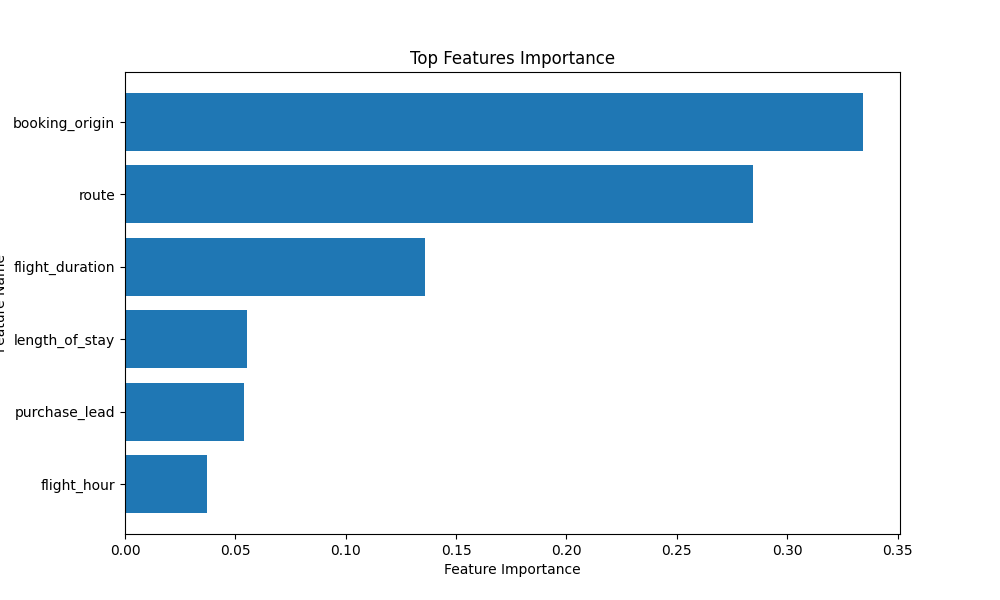
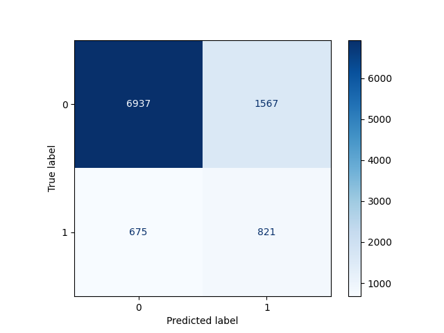

# BritishAirwaysCustomerBuyingBehavior

<!-- ### The main responsibilities:

 - Completed a simulation focusing on how data science is a critical component
   of British Airways success.
 - Scraped and analysed customer review data to uncover findings,
 - Built a predictive model to understand factors that influence buying
   behaviour.
-->
  
 ### **Background Context**:

- In the airline industry, accurate prediction of customer bookings is crucial for optimizing revenue, resource allocation, and operational efficiency. Airlines face challenges such as fluctuating demand, seasonal trends, and competitive pricing, making accurate booking predictions essential for strategic decision-making.

### **Business Problem**:

- The business problem is to predict whether a customer's booking will be completed or not based on various factors like sales channel, trip type, purchase lead time, and customer preferences. Accurate booking predictions help airlines allocate resources efficiently, manage flight schedules effectively, and enhance overall customer experience.

### **Data Understanding**:

- The dataset contains information about customer bookings, including features like num_passengers, sales_channel, trip_type, purchase_lead, flight_hour, etc., and the target variable 'booking_complete'. The data was sourced from airline booking systems and contains both numerical and categorical variables.

### **Exploratory Data Analysis (EDA)**:

- EDA revealed insights such as the distribution of booking completion rates, top countries for the booking, popular routes, patterns in customer preferences based on sales channels, popular schedules of the airline service, distribution of the booking completion.

  

  

  

  

  

  

  

### **Data Preparation**:

- Data preprocessing steps included handling missing values, encoding categorical variables, and scaling numerical features for model compatibility. Features like wants_extra_baggage, wants_preferred_seat, and wants_in_flight_meals were encoded into numerical format for modeling. For the columns route, booking_origin the number of unique values is very high, so we shall use target encoding for these columns. Then we shall treat them as continuous features.
- Split the data into train and test splits using 80/20 splits using stratification ensuring the distribution of the target is same in both the splits.
- To handle class imbalance we shall use SMOTE(Synthetic Minority Over-sampling Technique).

### **Modeling**:

- Random Forest Classifier was used for its feature importance feature and robustness.
- Models were trained using the prepared train data and using cross fold validation techniques.
- Hyperparameter tuning was performed to optimize model performance.

**Feature Importance:**  

 

### **Evaluation**:

- Model performance was evaluated using metrics like accuracy, precision, recall, F1-score, and ROC-AUC to assess their predictive capabilities. Confusion matrices and ROC curves were analyzed to understand model behavior and identify areas for improvement.

**Confusion Matrix**  

 

### **Challenges and Limitations**:

- Challenges included dealing with imbalanced classes in the target variable, ensuring data quality and consistency, and managing computational resources for model training. Limitations of the models included potential overfitting due to complex feature interactions and the need for continuous monitoring and updates in a dynamic airline industry environment.

### **Conclusion**:

- The project successfully developed machine learning models for predicting customer bookings in the airline industry, contributing to improved operational efficiency and customer satisfaction. Future enhancements may include integrating real-time data for more accurate predictions, exploring advanced modeling techniques, and addressing evolving customer preferences and market dynamics.
